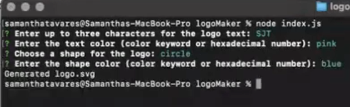

# Logo Maker

## Description
Logo Maker is a Node.js command-line application that allows users to generate simple 
<br />
logos for their projects. With Logo Maker, you can easily create SVG logos with 
<br />
customizable text and shape attributes.

## Installation
1. Make sure you have Node.js installed on your machine.
2. Clone this repository to your local machine.
3. Navigate to the project directory in the terminal.
Install the required dependencies by running the following command:
```
npm install
```
To use the Logo Maker application, run the following command in the terminal:
```
node index.js
```
The application will prompt you to enter the logo text, text color, shape choice, and
<br />
shape color. After providing the input, the application will generate an SVG logo
<br />
based on your choices and save it as "logo.svg" in the project directory.

## Demo/Link

<br />

<br />
Here's a link to the demo: https://drive.google.com/file/d/1zlbkxyVbgEbU6e1InjbWGFrHzq4I1QJg/view


